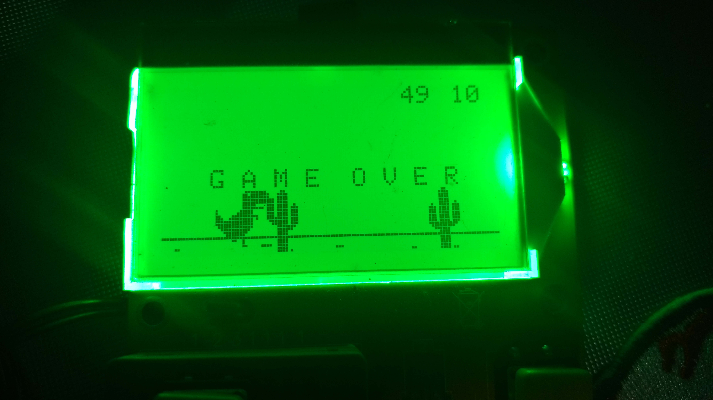

# Atmega T-rex
This is a chrome's t-rex like game written to run on a T3 component tester board.

It uses a modified version of Adafruit ST7565 library.

##Project details
There is a blog post detailing how I wrote the code and run it in the component tester

English version: http://dragaosemchama.com.br/2017/01/rex/

Portuguese version: Still writing

##Usage

This may not be supported by your board. mine is a T3 whith the reference QS2015-T3. Please have a look at the baord in my article before trying to upload new code to your board. In any case, **backup your flash and eeprom** before anything.

To burn the project to the board, connect your programmer and use:
```
make
make program
```
Of course you may have to edit the Makefile for your programmer.

I have included the component tester firmware hex file for my board in this repo, but it may be different from yours.



